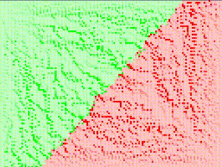

# Flood go
> Go simulation where two colonies fight for supremacy 



# Installation
### Install Go
This will differ per OS. Just follow the general instructions for your OS.

### Make sure sdl2, sld2_image, and sdl2_ttf are installed
In linux, you can simply search in the package manager for SDL, and install the
needed packages. The names in the title are the same in almost every distribution of linux.

### Download Go packages
You can now download the external packages that we'll be using:
```bash
go get github.com/veandco/go-sdl2/sdl
go get github.com/veandco/go-sdl2/img
go get github.com/veandco/go-sdl2/ttf
```

If you now look in your GOPATH, you'll find a pkg and a src folder.
> GOPATH defaults to `$HOME/go`

### Clone this repository to your computer
Go to the folder where you want to clone this folder to. In my case:

```bash
cd $HOME/git/
```

Now we can clone this repository

```bash
git clone https://github.com/dwrolvink/flood.git
```

### Test run
Go into the newly created folder and run the application to test it:
```bash
cd flood
go run main.go
```

You should see a white screen with green and red blocks rushing towards eachother.

To compile the application, and then run it, you can do the following:
```bash
go build
.\flood_go
```

To quickly build (and clean up the previous build before hand), you can use the
provided run script. To enable it, do this once to enable the script to be executed:
```bash
chmod +x run
```

Now you can build and run the program by doing:
```bash
./run
```

# Controls
- Space to reset
- Click (left/right) to add a block of color somewhere
